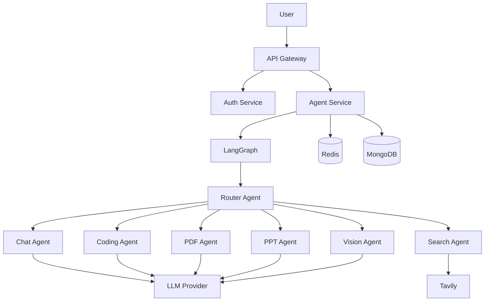
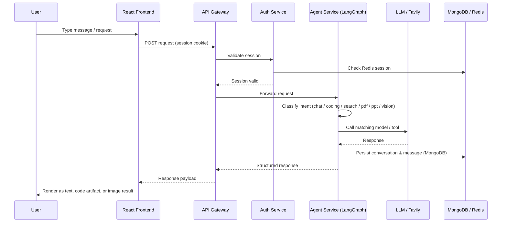

<div align="center">

# 🧠 CortexAI

### One Workspace. Every Agent You Need.

**Chat • Code • Search • Documents • Vision — routed intelligently, not bolted together.**

[](https://react.dev/)
[](https://expressjs.com/)
[](https://www.langchain.com/langgraph)
[](https://www.mongodb.com/)
[](https://redis.io/)
[](https://firebase.google.com/)
[](https://tailwindcss.com/)

[]()
[](#-contributing)
[]()

<br/>


*Swap this for a real screenshot or demo GIF once available — see [Screenshots](#-screenshots).*

</div>

<br/>

## 🎯 The Problem

Most people juggle **four or five separate AI tools** to get through a single day of work:

- One tab for ChatGPT-style conversation
- Another for a coding copilot
- Another for a search tool because the assistant's knowledge is stale
- A different app entirely for "explain this PDF" or "summarize this slide deck"
- And yet another for asking questions about a screenshot or image

Each tool has its own login, its own context window, its own history that doesn't talk to the others. You end up **copy-pasting between AI tools** just to finish one task — which defeats the point of having AI in the first place.

Most single-model chat apps make this worse by trying to cram every capability into one giant prompt, which makes the assistant slower, less accurate, and harder to extend. Bolting "web search" or "vision" onto one chat thread often means the interface becomes bloated and the routing logic becomes messy.

## 💡 Why CortexAI

**CortexAI treats different kinds of requests as genuinely different problems**, instead of forcing one model to be mediocre at all of them.

Under the hood, a **LangGraph router** looks at intent first — *is this a conversation, a coding task, a search query, a document question, or an image question?* — and only then hands the request to the right agent.

- 🗨️ Ask a general question → the **Chat Agent** answers conversationally
- 🧑‍💻 Ask for a login page → the **Coding Agent** classifies it as `code_generation` and returns structured files as artifacts, not a wall of text
- 🔎 Ask about something recent → the **Search Agent** pulls fresh, cited results via **Tavily**
- 📄 Ask about a document → **PDF/PPT agents** take over
- 🖼️ Ask about an image ��� the **Vision Agent** handles it

All of it sits behind one login, one conversation history, and one UI — so the "switching tabs" problem disappears.

<br/>

## ✨ Features

<table>
<tr>
<td width="33%" valign="top">

### 💬 AI Chat
Persistent, context-aware conversations with Markdown rendering and separate history per conversation.

</td>
<td width="33%" valign="top">

### 👨‍💻 Coding Agent
Classifies intent — generation, debugging, explanation, review, DSA, architecture, DB, API, frontend, DevOps — and responds accordingly.

</td>
<td width="33%" valign="top">

### 🧩 Structured Code Artifacts
Generated files (e.g. `Login.jsx`, `Login.css`, `api.js`) render in a dedicated **Artifact Panel**, separate from the chat.

</td>
</tr>
<tr>
<td width="33%" valign="top">

### 🔎 Web Search
Routed to a dedicated **Search Agent** powered by **Tavily** — results, sources, summaries, and images.

</td>
<td width="33%" valign="top">

### 🖼️ Image Search & Preview
Thumbnails, click-to-expand, and lightbox-style previews for search-result images.

</td>
<td width="33%" valign="top">

### 📄 Document & Vision Workflows
Architecture in place for PDF/PPT understanding and vision-based requests, extensible without touching core chat logic.

</td>
</tr>
<tr>
<td width="33%" valign="top">

### 🔐 Firebase + Session Auth
Google login via Firebase, verified server-side, backed by **Redis** sessions and protected API routes.

</td>
<td width="33%" valign="top">

### 💾 Persistent Conversations
**MongoDB** stores conversations and messages; **Redis** holds sessions and short-term agent memory.

</td>
<td width="33%" valign="top">

### 🎨 Dark AI-Workspace UI
React + Tailwind interface: sidebar, chat area, and artifact panel — laid out like a real workspace, not just a chat box.

</td>
</tr>
</table>

<br/>

## 🧠 Multi-Agent Architecture

CortexAI doesn't treat every request as the same kind of AI problem. It figures out **what** the user wants before deciding **who** should answer.



<br/>

## 🔀 Request Lifecycle



<br/>

## 🧑‍💻 Coding Intelligence in Action

The coding agent doesn't just "write code" — it first figures out **what** kind of coding help is being asked for, then shapes the response format to match.

```text
"Why am I getting Cannot read properties of undefined?"
                    │
                    ▼
              Intent Classifier
                    │
                    ▼
              code_debugging
                    │
                    ▼
           Focused Debugging Response


"Create a React authentication page"
                    │
                    ▼
              code_generation
                    │
                    ▼
             Structured JSON
                    │
                    ▼
      Login.jsx · Login.css · api.js
                    │
                    ▼
             Artifact Panel
```

Supported coding intents: **generation, debugging, explanation, review, DSA/algorithms, architecture, database, API/backend, frontend, DevOps & deployment.**

<br/>

## 🔌 Model Selection Layer

Agents don't call a hardcoded model directly — they go through a shared model-selection layer, making it easy to swap providers without touching agent logic:

```text
                getModel()
                    │
        ┌───────────┼───────────┐
        ▼           ▼           ▼
       Chat       Search      Coding
        │           │           │
        ▼           ▼           ▼
   Groq / Gemini   Tavily    Groq / Gemini / OpenRouter
```

<br/>

## 📁 Project Structure

```text
CortexAI/
│
├── frontend/
│   ├── src/
│   │   ├── components/
│   │   │   ├── Artifact/
│   │   │   ├── ChatArea/
│   │   │   ├── ChatInput/
│   │   │   ├── MessageBubble/
│   │   │   ├── MessageList/
│   │   │   └── SideBar/
│   │   ├── redux/
│   │   │   ├── userSlice
│   │   │   ├── conversationSlice
│   │   │   └── messageSlice
│   │   ├── utils/
│   │   │   ├── axios
│   │   │   └── firebase
│   │   └── ...
│   └── package.json
│
├── backend/
│   ├── gateway/                # API Gateway — entry point, auth guard, routing
│   │
│   ├── services/
│   │   ├── auth/                # Firebase verification, sessions, login/logout
│   │   │   ├── controllers/
│   │   │   ├── routes/
│   │   │   └── ...
│   │   │
│   │   └── agent/               # LangGraph orchestration & specialized agents
│   │       ├── agents/
│   │       ├── config/
│   │       ├── controllers/
│   │       ├── graph/
│   │       └── routes/
│   │
│   ├── shared/
│   └── docker-compose.yml
│
├── .gitignore
└── README.md
```

The **frontend workspace layout**:

```text
┌──────────────┬──────────────────────────┬──────────────────┐
│   Sidebar    │        Chat Area         │  Artifact Panel  │
│ Conversations│   User / AI Messages     │  Generated Files │
└──────────────┴──────────────────────────┴──────────────────┘
```

<br/>

## 🛠️ Tech Stack

| Category | Technology |
|---|---|
| Frontend | React (Vite) |
| Styling | Tailwind CSS |
| State Management | Redux Toolkit |
| Backend | Node.js + Express |
| Agent Framework | LangChain + LangGraph |
| Database | MongoDB |
| Sessions / Memory | Redis |
| Authentication | Firebase Authentication |
| Web Search | Tavily |
| AI Models | Groq / Google Gemini / OpenRouter |
| API Communication | Axios |
| Containerization | Docker |

<br/>

## 🚀 Getting Started

### 1. Clone the repository
```bash
git clone <your-repository-url>
cd CortexAI
```

### 2. Install frontend dependencies
```bash
cd frontend
npm install
```

### 3. Install backend dependencies
Install dependencies for the **gateway** and each **service** (`auth`, `agent`) according to their respective `package.json` files.

### 4. Configure environment variables
See [Environment Variables](#-environment-variables) below, then create the relevant `.env` files.

### 5. Start infrastructure
```bash
docker compose up
```

### 6. Run each piece in development

```bash
# Frontend
cd frontend
npm run dev

# Gateway
cd backend/gateway
npm run dev

# Auth Service
cd backend/services/auth
npm run dev

# Agent Service
cd backend/services/agent
npm run dev
```

The frontend talks to the gateway; the gateway talks to whichever backend service the request needs.

<br/>

## 🔑 Environment Variables

**Gateway**
```env
AUTH_SERVICE_URL=http://localhost:8001
AGENT_SERVICE_URL=http://localhost:8003
FRONTEND_URL=http://localhost:5173
REDIS_URL=redis://localhost:6379
```

**Agent Service**
```env
GROQ_API_KEY=your_key
GOOGLE_API_KEY=your_key
OPENROUTER_API_KEY=your_key
TAVILY_API_KEY=your_key
MONGO_URI=your_mongodb_connection
REDIS_URL=redis://localhost:6379
```

> ⚠️ Never commit API keys, Firebase credentials, `.env` files, or service-account JSON files to GitHub.

<br/>

## 💾 Data & Session Requirements

- **MongoDB** — the system of record for users, conversations, and messages. Works fine as a single local instance or Atlas cluster during development.
- **Redis** — backs sessions created after Firebase login, and holds short-term agent memory (recent conversation context) so agents can respond with continuity without hitting MongoDB on every request.

Both are wired up in `docker-compose.yml` for one-command local startup.

<br/>

## 🔒 Security

- Firebase-based authentication for login
- Redis-backed, HTTP-only cookie sessions
- Protected API routes behind the gateway's auth check
- Secrets isolated to environment variables
- `.gitignore` protection for credentials and service-account files
- Clear separation between the auth service and AI workloads

> Production deployments should additionally add HTTPS, secure cookie flags, rate limiting, input validation, structured logging, and proper secret management (e.g. a secrets manager instead of plain `.env` files).

<br/>

## 🖥️ Example Workflows

**General chat**
```text
"What is the difference between REST and GraphQL?" → Chat Agent → AI Response
```

**Code generation**
```text
"Create a React todo application" → Coding Intent Detection → Code Generation
    → Generated Files → Artifact Panel
```

**Debugging**
```text
"Why am I getting a 500 error from Axios?" → Coding Agent → Error Analysis
    → Debugging Response
```

**Web search**
```text
"Find recent information about NVIDIA's latest AI models" → Search Agent
    → Tavily → Search Results + Images
```

<br/>

## 📸 Screenshots

| Main Workspace | Coding + Artifact Panel | Search + Image Results |
|---|---|---|
|  |  |  |

<br/>

## 🗺️ Roadmap

**✅ Core**
- [x] React frontend · Express gateway · Firebase auth · Redis sessions · MongoDB
- [x] LangGraph agent architecture with Chat, Coding, and Search agents
- [x] Tavily integration with image search + lightbox preview
- [x] Coding artifact panel

**🚧 In Progress**
- [ ] Improved agent routing accuracy
- [ ] Better coding artifact management
- [ ] PDF and PPT workflows
- [ ] Vision workflows
- [ ] Deeper conversation memory
- [ ] Production deployment hardening

**🔮 Future**
- [ ] Streaming AI responses
- [ ] File upload system
- [ ] RAG / knowledge-base workflows
- [ ] Long-term memory
- [ ] Agent observability
- [ ] Advanced artifact editor

<br/>

## 📚 What This Project Demonstrates

Full-stack development · React architecture · REST APIs · Microservices · Firebase auth · Redis sessions · MongoDB · LangChain & LangGraph · Agent routing · LLM integration · Prompt engineering · Multi-agent orchestration.

<br/>

## 🤝 Contributing

```bash
git checkout -b feature/your-feature
```

Make your changes, test locally, and open a pull request. Issues and suggestions are welcome too.

<br/>

## 📄 License

Currently a personal learning and portfolio project. Open-source license details will be added if/when the project is formally released.

<br/>

## 👨‍💻 Author

**Rick Choudhury** — AI/ML student & full-stack AI developer, building CortexAI to explore the intersection of **AI × Agents × Full Stack × Systems**.

<br/>

<div align="center">

⭐ If CortexAI's architecture is useful or interesting to you, consider starring the repo.

</div>
