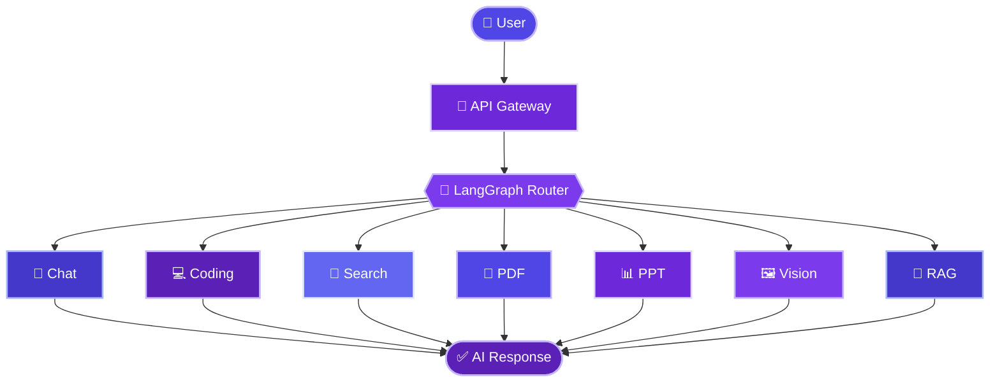
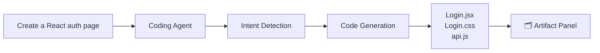
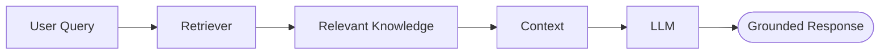
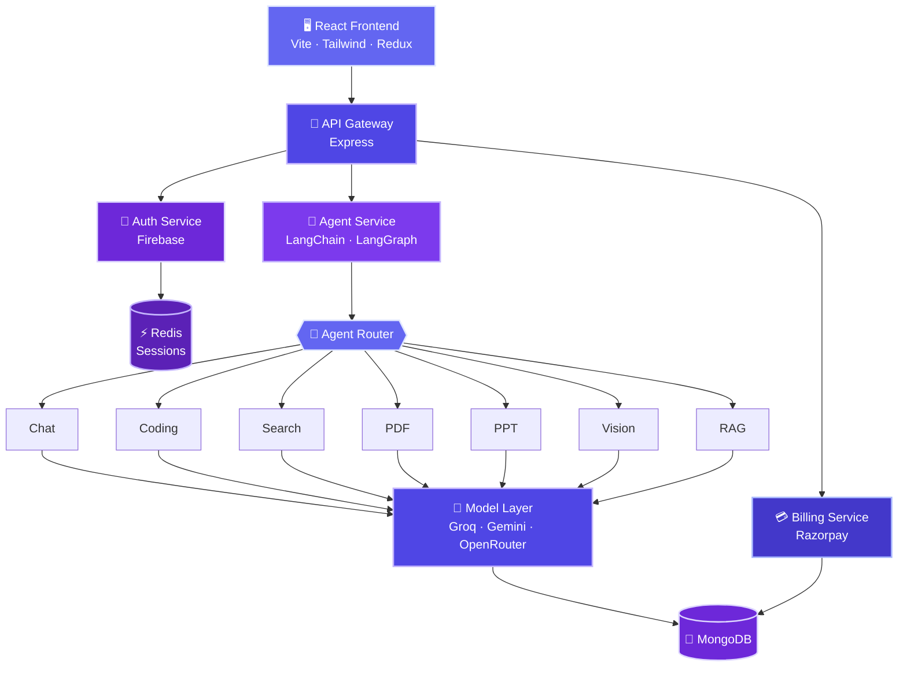
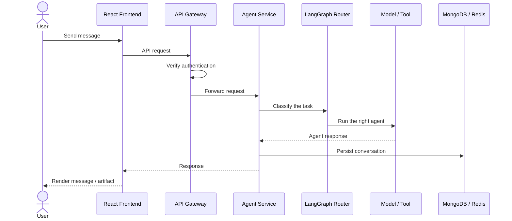
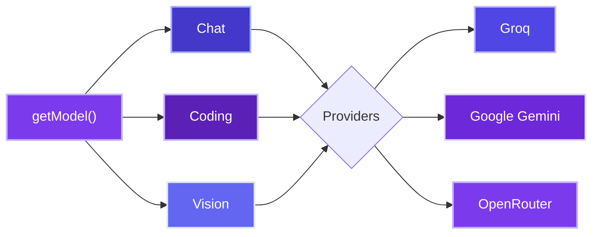
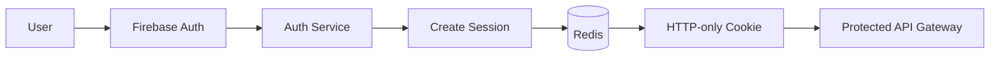

<div align="center">


<h1>Kivo AI</h1>

<h3>One Workspace. Every AI Agent You Need.</h3>


<br/><br/>


<br/>


<br/><br/>


<br/><br/>

### A multi-agent AI workspace for conversation, coding, web search, documents, images, RAG and more, all in one place.

[**✨ Why Kivo**](#-why-kivo) •
[**🤖 Agents**](#-meet-the-agents) •
[**🏗️ Architecture**](#%EF%B8%8F-architecture) •
[**⚡ Quick Start**](#-quick-start) •
[**🗺️ Roadmap**](#%EF%B8%8F-roadmap)

</div>

<br/>

> [!NOTE]
> **Chat. Code. Search. Documents. Presentations. Vision. Knowledge.** Instead of forcing one model to do everything, Kivo routes each request to a specialized agent through **LangGraph**.


## ✨ Why Kivo?

<table>
<tr>
<td width="50%" valign="top">

### 😕 One chatbot for everything

- A single model handles every task
- Switching between tools for code, research and documents
- Large code dumped inside chat bubbles
- Hard to extend with new capabilities

</td>
<td width="50%" valign="top">

### 🚀 Kivo's approach

- A **router** detects the task type first
- A **specialized agent** handles each request
- Code appears as **structured files** in an artifact panel
- New agents plug into the graph easily

</td>
</tr>
</table>


```mermaid
flowchart TB
    U([👤 User]) --> G[🚪 API Gateway]
    G --> R{{🧭 LangGraph Router}}
    R --> C[💬 Chat]
    R --> D[💻 Coding]
    R --> S[🔎 Search]
    R --> P[📄 PDF]
    R --> T[📊 PPT]
    R --> V[🖼️ Vision]
    R --> K[🧠 RAG]
    C & D & S & P & T & V & K --> A([✅ AI Response])

    style U fill:#4f46e5,color:#fff,stroke:#c4b5fd,stroke-width:2px
    style G fill:#6d28d9,color:#fff,stroke:#ddd6fe,stroke-width:2px
    style R fill:#7c3aed,color:#fff,stroke:#c4b5fd,stroke-width:2px
    style C fill:#4338ca,color:#fff,stroke:#a5b4fc,stroke-width:2px
    style D fill:#5b21b6,color:#fff,stroke:#c4b5fd,stroke-width:2px
    style S fill:#6366f1,color:#fff,stroke:#e0e7ff,stroke-width:2px
    style P fill:#4f46e5,color:#fff,stroke:#c4b5fd,stroke-width:2px
    style T fill:#6d28d9,color:#fff,stroke:#ddd6fe,stroke-width:2px
    style V fill:#7c3aed,color:#fff,stroke:#c4b5fd,stroke-width:2px
    style K fill:#4338ca,color:#fff,stroke:#a5b4fc,stroke-width:2px
    style A fill:#5b21b6,color:#fff,stroke:#c4b5fd,stroke-width:2px
```


## 🤖 Meet the Agents

| | Agent | What it does | Powered by |
| :---: | :--- | :--- | :--- |
| 💬 | **Chat** | Natural, context-aware, multi-turn conversations with Markdown replies | LLM |
| 💻 | **Coding** | Generates, debugs, explains and reviews code, and returns structured files | LLM |
| 🔎 | **Search** | Real-time web search with summaries, sources and image previews | Tavily |
| 📄 | **PDF** | Summarize, ask questions and extract information from PDFs | LLM |
| 📊 | **PPT** | Understand slides, summarize and extract content from presentations | LLM |
| 🖼️ | **Vision** | Analyze images, screenshots and UI designs | Vision model |
| 🧠 | **RAG** | Answers grounded in retrieved knowledge instead of model memory alone | Retriever + LLM |

<details>
<summary><b>💻 Coding Agent in detail</b></summary>
<br/>

**Supported tasks:** code generation · debugging · explanation · code review · DSA & algorithms · frontend · backend · APIs · database design · architecture · DevOps & deployment.

Instead of pasting huge code blocks into chat, the agent produces **structured artifacts**:


```mermaid
flowchart LR
    A["Create a React auth page"] --> B[Coding Agent]
    B --> C[Intent Detection]
    C --> D[Code Generation]
    D --> E["Login.jsx<br/>Login.css<br/>api.js"]
    E --> F[🗂️ Artifact Panel]
```

</details>

<details>
<summary><b>🔎 Search Agent in detail</b></summary>
<br/>

Powered by **Tavily**: real-time web search, result summaries, source references, image search and previews, and recent information retrieval.

</details>

<details>
<summary><b>🧠 RAG in detail</b></summary>
<br/>

Rather than relying only on the model's internal knowledge, RAG retrieves relevant information and passes it as context, which suits custom knowledge, user-provided information, documents, knowledge bases and domain-specific data.


```mermaid
flowchart LR
    Q[User Query] --> R[Retriever] --> K[Relevant Knowledge] --> X[Context] --> L[LLM] --> G([Grounded Response])
```

</details>

<details>
<summary><b>🖼️ Vision, 📄 PDF and 📊 PPT agents in detail</b></summary>
<br/>

- **Vision:** image understanding, screenshot analysis, object/content identification, visual explanations, UI screenshot analysis. Requests are routed to the Vision agent rather than treated as normal chat.
- **PDF:** document understanding, summarization, question answering, information extraction, PDF-based conversations.
- **PPT:** presentation analysis, slide understanding, summarization, question answering, content extraction.

</details>


<!--
📸 SCREENSHOTS: when you have them, put images in a `screenshots/` folder and uncomment this section.

## 📸 Screenshots

<div align="center">

<br/><br/>
<table>
<tr>
<td align="center"><b>💻 Code Artifact Panel</b><br/></td>
<td align="center"><b>🔎 Web Search</b><br/></td>
</tr>
<tr>
<td align="center"><b>🖼️ Image Analysis</b><br/></td>
<td align="center"><b>💳 Billing & Plans</b><br/></td>
</tr>
</table>
</div>


-->

## 🏗️ Architecture

Kivo follows a **service-oriented architecture**: authentication, AI workloads and billing are separate services behind one gateway.


```mermaid
flowchart TB
    FE["🖥️ React Frontend<br/>Vite · Tailwind · Redux"] --> GW["🚪 API Gateway<br/>Express"]

    GW --> AUTH["🔐 Auth Service<br/>Firebase"]
    GW --> AGENT["🤖 Agent Service<br/>LangChain · LangGraph"]
    GW --> BILL["💳 Billing Service<br/>Razorpay"]

    AUTH --> REDIS[("⚡ Redis<br/>Sessions")]
    AGENT --> ROUTER{{"🧭 Agent Router"}}

    ROUTER --> A1[Chat]
    ROUTER --> A2[Coding]
    ROUTER --> A3[Search]
    ROUTER --> A4[PDF]
    ROUTER --> A5[PPT]
    ROUTER --> A6[Vision]
    ROUTER --> A7[RAG]

    A1 & A2 & A3 & A4 & A5 & A6 & A7 --> MODELS["🧠 Model Layer<br/>Groq · Gemini · OpenRouter"]
    MODELS --> DB[("🍃 MongoDB")]
    BILL --> DB

    style FE fill:#6366f1,color:#fff,stroke:#e0e7ff,stroke-width:2px
    style GW fill:#4f46e5,color:#fff,stroke:#c4b5fd,stroke-width:2px
    style AUTH fill:#6d28d9,color:#fff,stroke:#ddd6fe,stroke-width:2px
    style AGENT fill:#7c3aed,color:#fff,stroke:#c4b5fd,stroke-width:2px
    style BILL fill:#4338ca,color:#fff,stroke:#a5b4fc,stroke-width:2px
    style REDIS fill:#5b21b6,color:#fff,stroke:#c4b5fd,stroke-width:2px
    style ROUTER fill:#6366f1,color:#fff,stroke:#e0e7ff,stroke-width:2px
    style MODELS fill:#4f46e5,color:#fff,stroke:#c4b5fd,stroke-width:2px
    style DB fill:#6d28d9,color:#fff,stroke:#ddd6fe,stroke-width:2px
```

### 🔀 Request Lifecycle


```mermaid
sequenceDiagram
    actor U as User
    participant F as React Frontend
    participant G as API Gateway
    participant A as Agent Service
    participant R as LangGraph Router
    participant M as Model / Tool
    participant D as MongoDB / Redis

    U->>F: Send message
    F->>G: API request
    G->>G: Verify authentication
    G->>A: Forward request
    A->>R: Classify the task
    R->>M: Run the right agent
    M-->>A: Agent response
    A->>D: Persist conversation
    A-->>F: Response
    F-->>U: Render message / artifact
```

### 🧠 Model Selection Layer

Agents are not tied to one model. A shared `getModel()` layer lets each agent use a different provider, so models can be swapped without rewriting the agent architecture.


```mermaid
flowchart LR
    GM["getModel()"] --> C[Chat] & D[Coding] & V[Vision]
    C & D & V --> P{Providers}
    P --> G1[Groq]
    P --> G2[Google Gemini]
    P --> G3[OpenRouter]

    style GM fill:#7c3aed,color:#fff,stroke:#c4b5fd,stroke-width:2px
    style C fill:#4338ca,color:#fff,stroke:#a5b4fc,stroke-width:2px
    style D fill:#5b21b6,color:#fff,stroke:#c4b5fd,stroke-width:2px
    style V fill:#6366f1,color:#fff,stroke:#e0e7ff,stroke-width:2px
    style G1 fill:#4f46e5,color:#fff,stroke:#c4b5fd,stroke-width:2px
    style G2 fill:#6d28d9,color:#fff,stroke:#ddd6fe,stroke-width:2px
    style G3 fill:#7c3aed,color:#fff,stroke:#c4b5fd,stroke-width:2px
```


## 🧩 The Workspace UI

Kivo's frontend is built as an **AI workspace**, not just a chat window.

```text
┌────────────────┬───────────────────────────┬─────────────────┐
│    Sidebar     │         Chat Area         │ Artifact Panel  │
│                │                           │                 │
│ Conversations  │    User / AI messages     │ Generated files │
│ Billing        │    Chat input             │ Code preview    │
└────────────────┴───────────────────────────┴─────────────────┘
```

**Frontend stack:** React · Vite · Tailwind CSS · Redux Toolkit · Axios · Firebase · Motion · React Markdown · Monaco Editor · Lucide Icons


## 💳 Billing & Credits

A credit-based SaaS model: users pick a plan and spend credits as they use AI agents. Payment processing is kept separate from AI workloads.

| Feature | Details |
| :--- | :--- |
| 🆓 Plans | Free · Starter · Pro |
| 🪙 Usage | Credit-based, managed server-side |
| ⏳ Expiry | Plan expiration support |
| 💸 Payments | Razorpay with server-side verification |
| 🔒 APIs | Protected billing routes |


```mermaid
flowchart LR
    A[Select Plan] --> B[Create Razorpay Order] --> C[Payment] --> D[Verify Payment] --> E[Update Plan] --> F[Add Credits] --> G([Use AI Agents])
    style A fill:#4338ca,color:#fff,stroke:#a5b4fc,stroke-width:2px
    style B fill:#5b21b6,color:#fff,stroke:#c4b5fd,stroke-width:2px
    style C fill:#6366f1,color:#fff,stroke:#e0e7ff,stroke-width:2px
    style D fill:#4f46e5,color:#fff,stroke:#c4b5fd,stroke-width:2px
    style E fill:#6d28d9,color:#fff,stroke:#ddd6fe,stroke-width:2px
    style G fill:#7c3aed,color:#fff,stroke:#c4b5fd,stroke-width:2px
```


## 🔐 Authentication & Security


```mermaid
flowchart LR
    U[User] --> F[Firebase Auth] --> A[Auth Service] --> S[Create Session] --> R[(Redis)] --> C[HTTP-only Cookie] --> G[Protected API Gateway]
```

| Currently implemented | Recommended for production |
| :--- | :--- |
| ✅ Firebase authentication | 🔲 HTTPS everywhere |
| ✅ Server-side token verification | 🔲 Secure cookie configuration |
| ✅ Redis-backed sessions | 🔲 Rate limiting |
| ✅ HTTP-only cookies | 🔲 Input validation |
| ✅ Gateway-level authentication | 🔲 Structured logging |
| ✅ Environment-based secrets | 🔲 Secret management |
| ✅ Separated backend services | 🔲 Monitoring & error tracking |
| ✅ Server-side payment verification | |


## 🛠️ Tech Stack

<div align="center">

| Category | Technology |
| :--- | :--- |
| **Frontend** | React + Vite |
| **Styling** | Tailwind CSS |
| **State** | Redux Toolkit |
| **Backend** | Node.js + Express |
| **Agents** | LangChain + LangGraph |
| **Database** | MongoDB |
| **Sessions / Memory** | Redis |
| **Auth** | Firebase Authentication |
| **Search** | Tavily |
| **AI Models** | Groq · Google Gemini · OpenRouter |
| **Payments** | Razorpay |
| **Code Editor** | Monaco Editor |
| **Containers** | Docker |

</div>


## 📁 Project Structure

<details>
<summary><b>Click to expand</b></summary>

```text
Kivo-AI/
├── frontend/
│   ├── src/
│   │   ├── components/
│   │   │   ├── Artifact/
│   │   │   ├── ChatArea/
│   │   │   ├── ChatInput/
│   │   │   ├── MessageBubble/
│   │   │   ├── MessageList/
│   │   │   └── SideBar/
│   │   ├── redux/
│   │   │   ├── userSlice
│   │   │   ├── conversationSlice
│   │   │   └── messageSlice
│   │   └── utils/
│   └── package.json
│
├── backend/
│   ├── gateway/
│   ├── services/
│   │   ├── auth/       controllers · routes · ...
│   │   ├── agent/      agents · config · controllers · graph · routes · ...
│   │   └── billing/
│   ├── shared/
│   └── docker-compose.yml
│
├── .gitignore
└── README.md
```

</details>


## 💡 Example Workflows

| You say or do | Routed to | Result |
| :--- | :--- | :--- |
| *"What is the difference between REST and GraphQL?"* | 💬 Chat Agent | Clear AI explanation |
| *"Create a React Todo application"* | 💻 Coding Agent | Structured files in the Artifact Panel |
| *"Find the latest AI news"* | 🔎 Search Agent (Tavily) | Summarized results with sources |
| Upload a PDF | 📄 PDF Agent | Document understanding and answers |
| Upload an image | 🖼️ Vision Agent | Image analysis |
| Ask over your knowledge base | 🧠 RAG Agent | Grounded response |


## ⚡ Quick Start

### 1️⃣ Clone

```bash
git clone <your-repository-url>
cd Kivo-AI
```

### 2️⃣ Install dependencies

```bash
# Frontend
cd frontend
npm install

# Gateway (repeat for each backend service you run)
cd ../backend/gateway
npm install
```

### 3️⃣ Configure environment variables

Create a `.env` file for each service.

<details>
<summary><b>🚪 Gateway</b></summary>

```env
AUTH_SERVICE_URL=http://localhost:8001
AGENT_SERVICE_URL=http://localhost:8003
FRONTEND_URL=http://localhost:5173
REDIS_URL=redis://localhost:6379
```

</details>

<details>
<summary><b>🤖 Agent Service</b></summary>

```env
GROQ_API_KEY=your_key
GOOGLE_API_KEY=your_key
OPENROUTER_API_KEY=your_key
TAVILY_API_KEY=your_key
MONGO_URI=your_mongodb_connection
REDIS_URL=redis://localhost:6379
```

</details>

<details>
<summary><b>💳 Billing Service</b></summary>

```env
RAZORPAY_KEY_ID=your_key
RAZORPAY_SECRET_KEY=your_secret
```

</details>

> [!CAUTION]
> Never commit API keys, Firebase credentials, service-account files or `.env` files to GitHub.

> [!TIP]
> Start the infrastructure first so Redis and MongoDB are ready before the services boot.

### 4️⃣ Start infrastructure

```bash
docker compose up
```

### 5️⃣ Run in development

Open a terminal for each service:

| Service | Command |
| :--- | :--- |
| 🖥️ Frontend | `cd frontend && npm run dev` |
| 🚪 Gateway | `cd backend/gateway && npm run dev` |
| 🔐 Auth | `cd backend/services/auth && npm run dev` |
| 🤖 Agent | `cd backend/services/agent && npm run dev` |

Open **http://localhost:5173**. The frontend talks to the gateway, and the gateway routes each request to the right backend service.


## 🗺️ Roadmap

<table>
<tr>
<td width="33%" valign="top">

### ✅ Completed

- [x] React frontend
- [x] Express API Gateway
- [x] Firebase authentication
- [x] Redis sessions
- [x] MongoDB persistence
- [x] LangGraph architecture
- [x] Chat Agent
- [x] Coding Agent
- [x] Search Agent + Tavily
- [x] Image search
- [x] PDF workflow
- [x] PPT workflow
- [x] Vision Agent
- [x] RAG workflow
- [x] Code Artifact Panel
- [x] Billing + Razorpay
- [x] Credit-based plans

</td>
<td width="33%" valign="top">

### 🚧 Improving

- [ ] Better agent routing accuracy
- [ ] Streaming AI responses
- [ ] Advanced RAG pipelines
- [ ] Better document ingestion
- [ ] Improved artifact management
- [ ] Deeper conversation memory
- [ ] Better observability
- [ ] Production deployment
- [ ] Performance optimization

</td>
<td width="33%" valign="top">

### 🔮 Future

- [ ] Long-term memory
- [ ] Advanced knowledge bases
- [ ] More AI agents
- [ ] Agent-to-agent collaboration
- [ ] Workflow automation
- [ ] Team workspaces
- [ ] Collaboration features
- [ ] More model providers
- [ ] Advanced analytics

</td>
</tr>
</table>


## 📊 What This Project Demonstrates

A portfolio-level project showing practical experience in:

`Full-stack development` · `React architecture` · `Node.js & Express` · `REST APIs` · `Microservices` · `API Gateway` · `Firebase Auth` · `Redis sessions` · `MongoDB` · `LangChain` · `LangGraph` · `Multi-agent systems` · `Agent routing` · `RAG` · `LLM integration` · `Prompt engineering` · `Computer vision workflows` · `Document AI` · `Web search` · `Structured code generation` · `AI artifacts` · `Payment integration` · `Credit-based SaaS` · `Docker` · `Cloud-ready architecture`


## 🎯 Project Vision

> [!IMPORTANT]
> **AI should feel like a workspace, not a collection of disconnected tools.**

Instead of opening separate apps for coding, research, document analysis, image understanding and general AI help, Kivo brings these workflows behind one interface and routes each task to the right agent.


<div align="center">

## 👨‍💻 Author

**Anirban Choudhury**
AI/ML Student & Full-Stack AI Developer

Building Kivo AI at the intersection of **AI × Agents × Full Stack × Systems**

<br/>

### ⭐ If you find Kivo interesting, give the repository a star and follow along!


### Kivo AI
**One Workspace. Every AI Agent You Need.**

Built with ❤️ by **Anirban Choudhury**


</div>
